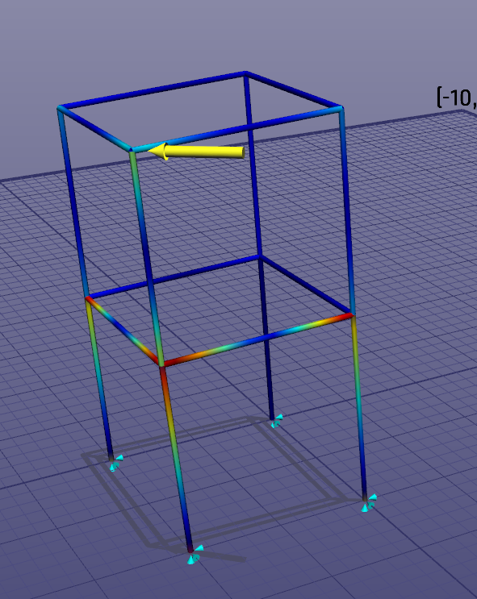

# ObjectiveFrame

Interactive real-time finite element analysis for structural mechanics education and experimentation.

ObjectiveFrame lets you build beam and frame structures, apply loads and boundary conditions, and explore deformation, internal forces, and eigenmodes with immediate visual feedback. It is designed for structural mechanics teaching, finite element experimentation, and lightweight open-source FEA workflows.

[Download](https://github.com/jonaslindemann/objectiveframe/releases/latest) | [Documentation](https://jonaslindemann.github.io/objectiveframe/) | [Quick start](https://jonaslindemann.github.io/objectiveframe/quick-start/) | [Examples](https://jonaslindemann.github.io/objectiveframe/examples/) | [Videos](https://jonaslindemann.github.io/objectiveframe/videos/) | [Cite](https://jonaslindemann.github.io/objectiveframe/cite/)

> Placeholder: replace this still image with a 5-10 second GIF or WebP showing feedback mode, load movement, deformation updates, or eigenmode animation.

## Why ObjectiveFrame?

- Real-time structural feedback while exploring loads and deformation.
- Interactive beam and frame modelling for structural mechanics education.
- Eigenmode visualization for understanding unstable or under-constrained models.
- Lightweight C++ and OpenGL desktop application.
- Open-source codebase with a long research lineage.
- Scriptable workflows using ChaiScript plugins.
- CALFEM-oriented export path for teaching and Python-based analysis workflows.

## Quick Start

1. Download the latest release from [GitHub Releases](https://github.com/jonaslindemann/objectiveframe/releases/latest).
2. Open one of the included example models from `bin/examples`.
3. Add or modify loads and boundary conditions.
4. Run the analysis and inspect deformation, normal force, moment, or eigenmode behavior.
5. Enable feedback mode to move a force and see the structure update interactively.

See the full [Quick Start guide](https://jonaslindemann.github.io/objectiveframe/quick-start/) for a screenshot-based walkthrough.

## Example Projects

ObjectiveFrame ships with example `.df3` models for bridges, buildings, domes, masts, space frames, and multiple load cases. These are useful for demos, classroom exercises, regression checks, and learning finite element modelling step by step.

See the [examples gallery](https://jonaslindemann.github.io/objectiveframe/examples/).

## What Makes It Different?

| Capability | ObjectiveFrame | Typical commercial FEA |
| --- | --- | --- |
| Open source | Yes | Usually no |
| Real-time interaction | Core workflow | Often limited |
| Educational FEM focus | Strong | Varies |
| Lightweight desktop use | Yes | Often heavier |
| Beam/frame exploration | Primary use case | One feature among many |
| Scriptable examples | Yes | Varies |
| Research lineage | Explicit | Usually product-focused |

ObjectiveFrame is not trying to replace large industrial FEA suites. Its strength is interactive structural understanding: fast modelling, visual intuition, and immediate feedback for beam and frame behavior.

## Students and Educators

ObjectiveFrame is well suited for teaching topics such as:

- Beam and frame deformation.
- Load paths and support reactions.
- Boundary condition modelling.
- Section forces and moments.
- Eigenmodes and unstable structures.
- The relationship between finite element models and structural intuition.

Start with [Learning FEM with ObjectiveFrame](https://jonaslindemann.github.io/objectiveframe/learning/).

## Implementation

ObjectiveFrame is implemented in C++ using OpenGL for hardware-accelerated rendering. The current user interface uses [Dear ImGui](https://github.com/ocornut/imgui) with [GLFW](https://www.glfw.org/). Structural analysis uses [Eigen](https://eigen.tuxfamily.org/), and beam/truss structures can be generated from points using [TetGen](https://www.wias-berlin.de/software/index.jsp?id=TetGen&lang=1).

The project also builds on the [Interactive Visualisation Framework - Ivf++](https://github.com/jonaslindemann/ivfplusplus).

## Research Lineage

ObjectiveFrame was originally developed at Structural Mechanics at Lund University by Jonas Lindemann as part of PhD work on real-time explorable finite element analysis and direct feedback methods.

- [Objective Frame - An educational tool for understanding the behavior of structures](https://portal.research.lu.se/en/publications/objective-frame-an-educational-tool-for-understanding-the-behavio)
- [Techniques for distributed access and visualisation computational mechanics](https://www.lth.se/fileadmin/byggnadsmekanik/publications/tvsm1000/web1016.pdf)
- [CORBA in distributed finite element applications](https://portal.research.lu.se/en/publications/corba-in-distributed-finite-element-applications)
- [Using 3D gesture controls for interacting with mechanical models](https://portal.research.lu.se/en/publications/using-3d-gesture-controls-for-interacting-with-mechanical-models-2)

Pierre Olsson developed routines and user interfaces for computing section properties. Daniel Akesson implemented 3D gesture controls using a Leap Motion controller for interacting with finite element models.

## Roadmap

The short-term roadmap focuses on onboarding, examples, educational workflows, scripting, CALFEM integration, solver improvements, and broader platform support. See the [project roadmap](https://jonaslindemann.github.io/objectiveframe/roadmap/).

## Contributing

Issues, examples, documentation improvements, and educational exercises are welcome. See [CONTRIBUTING.md](CONTRIBUTING.md) for the current contribution guide.

## Cite

If ObjectiveFrame supports teaching, research, or published work, please cite the project. See [CITATION.cff](CITATION.cff) and the [citation guide](https://jonaslindemann.github.io/objectiveframe/cite/).

## License

ObjectiveFrame is distributed under the MIT License. See [LICENSE](LICENSE).
