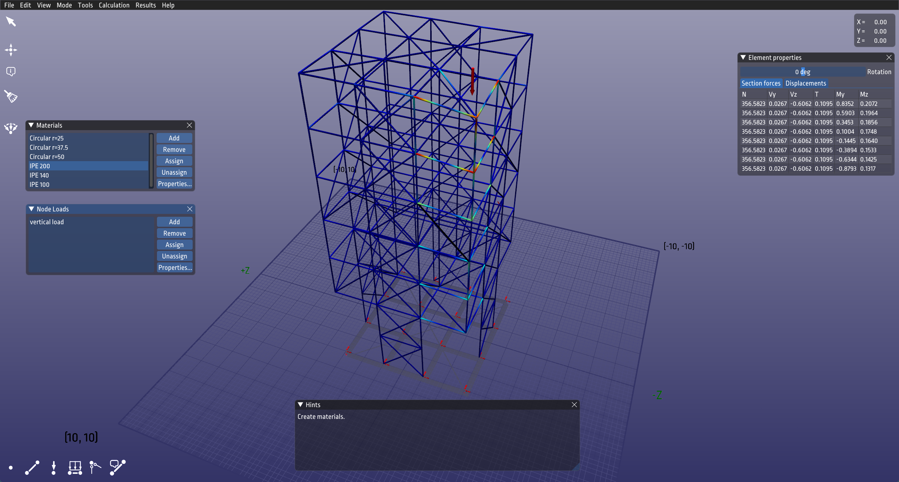

# ObjectiveFrame

Interactive real-time structural analysis for learning and exploring finite element behavior.

ObjectiveFrame is an open-source finite element analysis tool for beam and frame structures. It focuses on fast modelling, immediate visual feedback, eigenmode exploration, and educational structural mechanics workflows.

!!! note "Visual demo placeholder"

    Replace this still image with a short animated GIF or WebP showing the feedback force being moved while deformation and internal forces update in real time.

## Why ObjectiveFrame?

- Real-time feedback for loads, deformation, and section forces.
- Interactive beam and frame modelling without a heavy CAD workflow.
- Eigenmode visualization for unstable and under-constrained structures.
- Open-source C++ and OpenGL application.
- Lightweight desktop workflow for classrooms and experiments.
- ChaiScript plugins for scripted structure generation.
- CALFEM-oriented export path for Python-based teaching workflows.

## Start in 60 Seconds

1. [Download the latest release](download.md).
2. Open an example model such as a bridge, dome, building, or space frame.
3. Add a load or boundary condition.
4. Run the analysis and inspect deformation, normal force, moment, or eigenmode behavior.
5. Switch to feedback mode and move a force to build structural intuition.

[Open the quick start guide](quick-start.md)

## Explore Examples

ObjectiveFrame includes example projects for:

- Bridge trusses and beam bridges.
- Dome frames and dome trusses.
- Building frames.
- Space frames.
- Multiple load cases.
- Bar masts and simple beam models.

[Browse the example gallery](examples.md)

## Built for Structural Intuition

| Feature | ObjectiveFrame | General-purpose commercial FEA |
| --- | --- | --- |
| Open source | Yes | Usually no |
| Real-time interaction | Central workflow | Often limited |
| Educational finite element focus | Strong | Varies |
| Lightweight beam/frame exploration | Yes | Often one workflow among many |
| Scriptable examples | Yes | Varies |
| Fast classroom demos | Yes | Often more setup-heavy |

ObjectiveFrame is strongest when the goal is interactive structural mechanics: seeing how a finite element model responds while you change loads, supports, geometry, and modelling assumptions.

## Students and Educators

Use ObjectiveFrame to teach and explore beam deformation, boundary conditions, load paths, support reactions, section forces, moments, eigenmodes, and unstable structures.

[Start learning FEM with ObjectiveFrame](learning.md)

## Research Lineage

ObjectiveFrame was originally developed at Structural Mechanics at Lund University by Jonas Lindemann as part of PhD work on real-time explorable finite element analysis and direct feedback methods. The project also has roots in distributed finite element applications, visualization research, and experimental interaction techniques.

[Read more about the project background](about.md)

## Keywords

ObjectiveFrame is open-source FEA software for structural analysis, beam analysis, educational FEM, interactive structural mechanics, structural simulation, real-time finite element analysis, and structural mechanics teaching.
