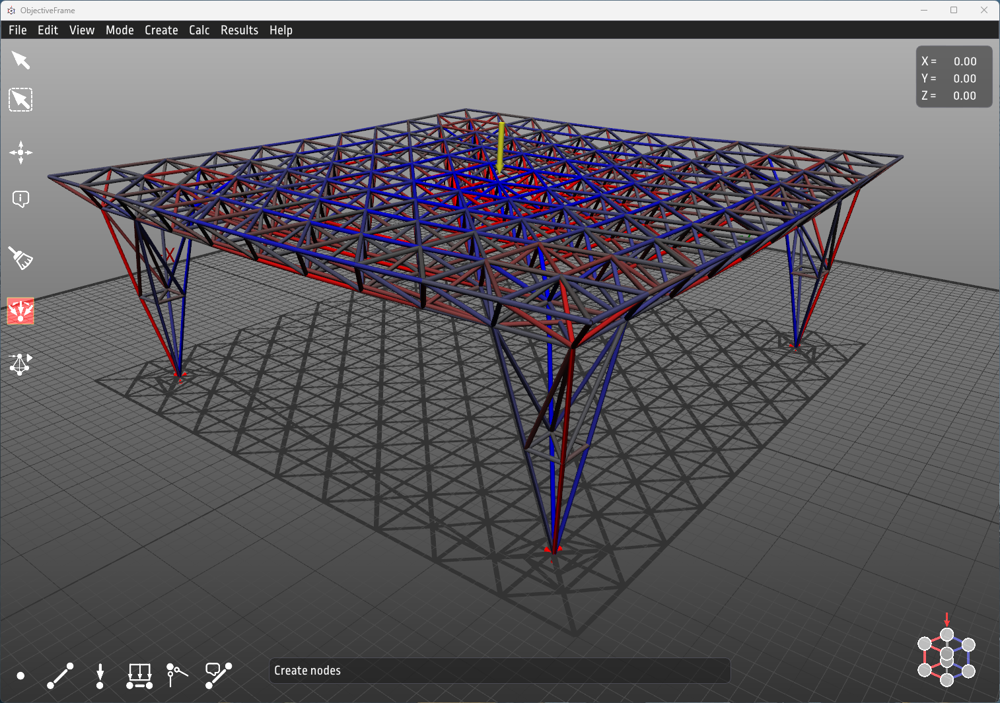

---
hide:
  - navigation
---

# Welcome to the ObjectiveFrame website

ObjectiveFrame is a finite element beam analysis application developed at Structural Mechanics at Lund university. The application focused on how to make finite element analysis real-time explorable with direct feedback methods.

On this page you will find information on installing, using and developing ObjectiveFrame.

