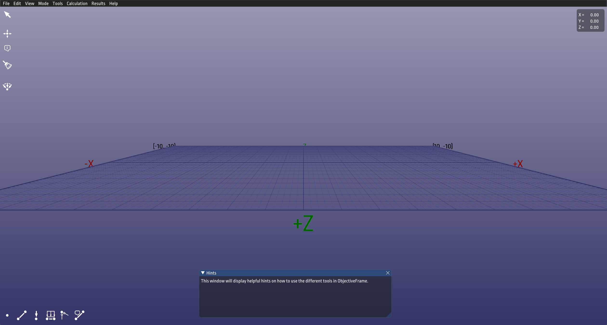
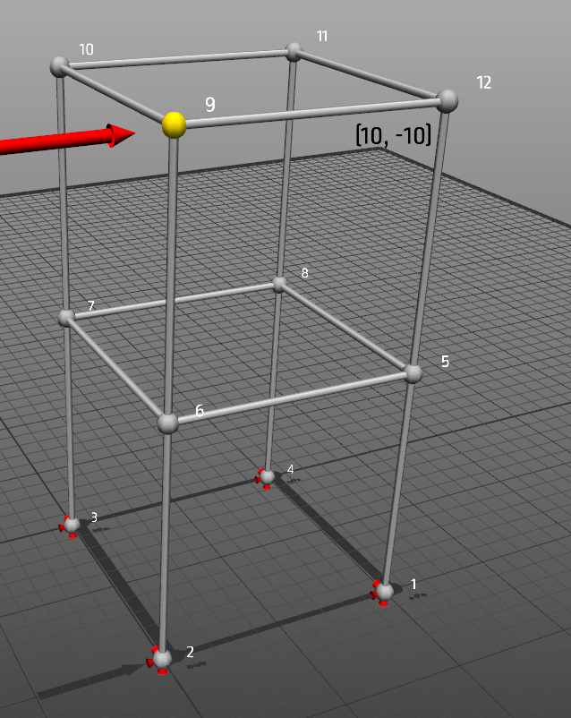
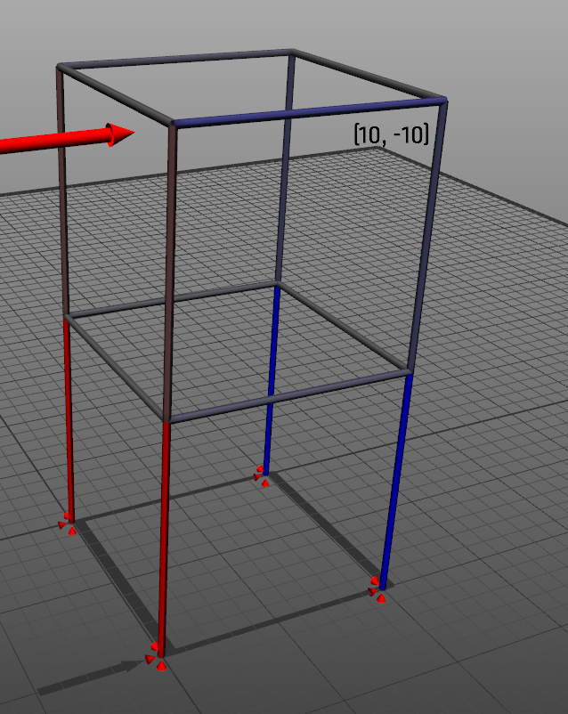
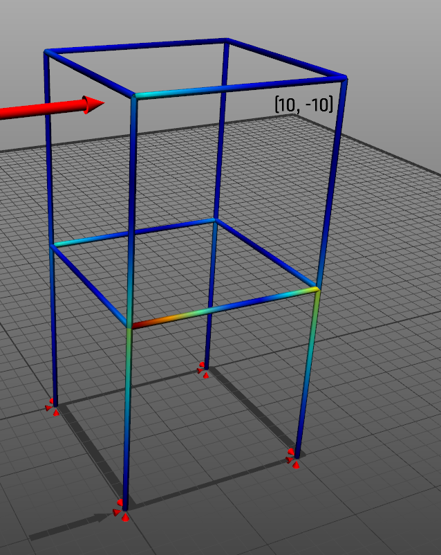

# Quick Start

This walkthrough gets you from download to an interactive structural response in about a minute.

!!! note "Demo placeholder"

    Add a short GIF or WebP here showing the full flow: open an example, run the analysis, switch to feedback mode, and move a load.

## 1. Download ObjectiveFrame

Download the latest Windows release from GitHub:

[Download the latest release](https://github.com/jonaslindemann/objectiveframe/releases/latest)

Unpack or install the release, then start `objectiveframe.exe`.

## 2. Open an Example

Open an included `.df3` model from the examples folder. Good first examples are:

- `bin/examples/bar_bridge.df3`
- `bin/examples/bridge_with_beams.df3`
- `bin/examples/dome_frame.df3`
- `bin/examples/building_with_load.df3`

## 3. Run the Analysis

Use **Calc / Execute** or press **Ctrl+R** to compute the structural response.

ObjectiveFrame can visualize deformation, normal forces, moments, and other result modes.

## 4. Explore Section Forces

Switch result views to inspect the internal force state of the model.

## 5. Move a Force in Feedback Mode

Enable feedback mode, place a force on a node, and move it interactively. The structure updates in real time so you can see how load position and direction affect deformation and section forces.

!!! tip

    Feedback mode is the fastest way to demonstrate structural intuition in class: students can see immediately how changing a load changes the response.

## Next Steps

- Browse the [examples gallery](examples.md).
- Learn the core modelling workflow in [Using ObjectiveFrame](use.md).
- Explore unstable structures with the [Eigenmode solver](eigenmode-solver.md).
- Try script-based model generation with [ChaiScript](chaiscript.md).
