# Using ObjectiveFrame

To give a short overview of what ObjectiveFrame can offer please view the following tutorial:

<iframe width="560" height="315" src="https://www.youtube.com/embed/ejHFFXANx7o" title="YouTube video player" frameborder="0" allow="accelerometer; autoplay; clipboard-write; encrypted-media; gyroscope; picture-in-picture" allowfullscreen></iframe>

## User guide map

This page covers the core modelling workflow: navigation, nodes, beams, loads, boundary conditions, materials, geometry modification, and result visualization.

More specialized workflows are documented separately:

- [AI / LLM integration](llm-integration.md) describes prompt-based structure generation and how generated scripts are reviewed and run.
- [Eigenmode solver](eigenmode-solver.md) explains instability diagnostics, mode shapes, animation, and eigenvalue interpretation.
- [ChaiScript scripting](chaiscript.md) documents the script interface used by plugins and AI-generated models.
- [Automation API](rest-api.md) documents the local HTTP service used to drive ObjectiveFrame from Python.

## Starting ObjectiveFrame

### The start page

ObjectiveFrame opens on a start page. It holds the commands you need before there is a model on screen, and a grid of example models that open on a click.

| Button | Does |
| --- | --- |
| **New Project...** | Start an empty model |
| **Open Model...** | Open an existing `.df3` model |
| **Open AI prompt...** | Describe a structure in words and let the LLM integration generate it |
| **Open Python model...** | Open a CALFEM for Python model |
| **Documentation** | Open this documentation in a browser |
| **Start automation API** | Start the local [HTTP service](rest-api.md) on port 8081 |

The start page can be reopened at any time from **File / Start page**.

### Simple and Advanced interface

The start page also chooses which interface ObjectiveFrame presents.

- **Simple** hides the parts of the interface that a first-time user does not need: the choice of element type, the node load, beam load, support and material property dialogs, the selection filter buttons, and the analytical half of the eigenmode panel.
- **Advanced** shows everything. This is the default, and what the rest of this guide describes.

The mode is a view of the same program, not a different file format: a model carries all of its data either way, and switching modes never changes the model. The choice is remembered between sessions, and can be changed at any time — the interface follows on the next frame, without a restart.

Starting `objframe.exe --ui-mode=simple` (or `--ui-mode=advanced`) starts in that mode for one run without changing the stored setting, which is useful for a lab shortcut that should always come up simple.

## Main window and view

When you start the application the main workspace is displayed. The workspace is your workbench where you create your structures. By default the workspace is 20 x 20 units large. The size can be changed from the **File / Preferences...** dialog.

The view can be changed using the mouse. All view functions are handled by the right mouse button in combination with a modifier key.

* Holding down the right button and moving the mouse will rotate the view.
* Holding down the right button with the [Shift]-key will pan the view.
* Holding down the right button with the [Alt]-key will zoom in and out.

**View / Fit workspace to model** resizes the workspace around whatever is currently modelled, which is the quickest way to recover after a script or an array has built something larger than the grid.

On the screen is also a **Hints** window displaying helpful hints for the different available tools.

The top left toolbar contains the editing toolbar providing selection, move, copy, remove and property inspection functionality.

The lower left toolbar contains functions for creating nodes, elements, loads, boundary conditions and section properties. These are described in the following sections.

The top right of the window carries the coordinate display: the cursor position, the active work plane, the selection filter in force, and how many objects are selected. Below it is the result toolbar, which switches between normal force, torsion, shear, moment, Navier utilization and no result without going through the menu.

## The work plane

Everything you place with the mouse is placed on a plane, because a screen has two dimensions and the model has three. By default that plane is the horizontal XZ ground plane.

Holding [Shift] while placing moves the cursor in a vertical plane instead. A translucent construction plane with grid lines appears while the cursor is off the ground, so you can see which plane you are working on, and a crosshair on the ground with a line up to the cursor shows where above the ground you are. This applies to every tool that places the 3D cursor: creating nodes, moving nodes, dragging, and placing a paste.

### Locking a plane

Holding a modifier down through a long piece of modelling is tiring, and it makes the plane depend on the keyboard rather than on what you decided. **View / Work plane** pins it instead:

| Command | Does |
| --- | --- |
| **Lock horizontal (XZ)...** | Pick a height; the working plane sits at it |
| **Lock vertical (XY)...** | Pick a point; the plane passes through it |
| **Lock vertical (YZ)...** | Pick a point; the plane passes through it |
| **Release lock** | Back to [Shift]-driven plane selection |

Each locking command starts a point pick: the plane is known from the menu, but where it passes through is not, so click the point it should go through. [Esc] cancels the pick.

While a lock is in force [Shift] is ignored, the construction plane stays visible instead of appearing only while a key is down, and every placement tool works against the locked plane. The menu and the coordinate display both show which plane is active, for example `XY @ z=2.50`. The plane can also be picked directly from the coordinate readout.

## Modeling

### Creating nodes

Nodes are created by selecting the node tool (first icon to the left in the lower toolbar). A cursor is shown on the workspace:

<figure markdown>
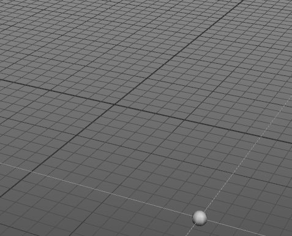
<figcaption>Workspace cursor</figcaption>
</figure>

At the top right of the window the current position of the cursor is shown:

<figure markdown>
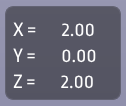
<figcaption>Coordinate display.</figcaption>
</figure>

By default the cursor is locked in the XZ-plane, but can be moved vertically in the Y-direction by holding down the [Shift]-modifier.

<figure markdown>
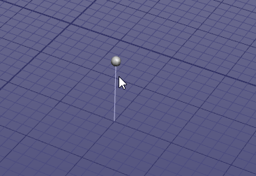
<figcaption>Locking cursor in Y-direction.</figcaption>
</figure>

### Selecting elements/nodes

There are three selection tools in the top left toolbar. They differ only in how you point at things — what happens to what you point at is the same for all three.

<figure markdown>
{width=100}
<figcaption>Select tool</figcaption>
</figure>

* **Select** — click on a node or element. Objects highlight as the mouse passes over them.
* **Box select** — hold the mouse button down and drag a rectangle.
* **Paint select** — hold the mouse button down and sweep the cursor over objects. Useful for an irregular group that no rectangle fits.

The current selection is highlighted in yellow.

<figure markdown>
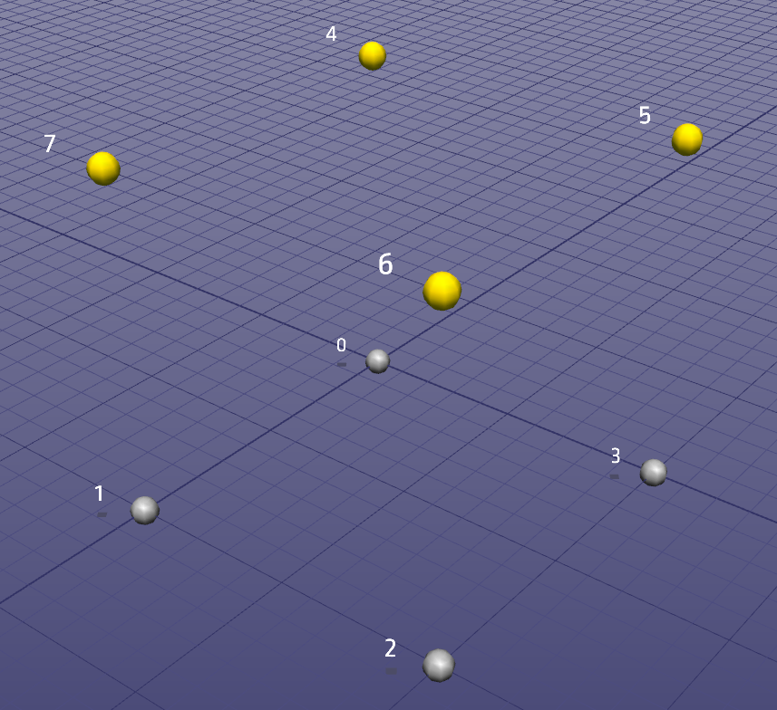
<figcaption>Selected nodes.</figcaption>
</figure>

#### Adding and removing

All three tools follow the same convention:

| Modifier | Effect |
| -------- | ------ |
| *none* | Replaces the current selection |
| [Shift] | Adds to the current selection |
| [Ctrl] | Removes from the current selection |

Clicking empty workspace without a modifier clears the selection.

#### Box select

The rectangle is drawn on the screen rather than in the model, so the camera decides what it catches. Rotate the view until the objects you want line up behind one another, then drag across them. This is usually the quickest way to grab everything at one level of a frame, or one face of a structure.

The direction you drag changes what is caught:

* **Left to right** takes only what falls *entirely* inside the rectangle. The rectangle is drawn in blue.
* **Right to left** also takes anything the rectangle *touches*, including elements crossing it with both ends outside. The rectangle is drawn in green.

For nodes there is no difference — a node is either in the rectangle or it is not. The distinction matters for elements.

#### Restricting what can be selected

The three filter buttons next to the selection tools decide what the tools are allowed to pick up: everything, nodes only, or elements only. On a dense frame this stops a rectangle from catching elements you meant to leave alone.

The filter stays in force when you switch between the three selection tools. The active filter and the number of selected objects are shown in the coordinate display at the top right of the window.

**Edit / Select all** ([Ctrl+A]) also honours the filter, so it selects everything, only the nodes, or only the elements depending on which filter button is active. **Edit / Select all nodes** and **Edit / Select all elements** ignore the filter and leave it untouched.

!!! note

    The filter buttons are not shown in the Simple interface, where selection always picks up both nodes and elements.

#### Selecting from the current selection

**Edit / Select from selection** holds commands that follow the structure rather than the screen. Each one starts from whatever is already selected:

| Command | Selects |
| ------- | ------- |
| **Grow** [Ctrl++] | One more ring of nodes and elements outwards |
| **Shrink** [Ctrl+-] | Strips the outer ring, the inverse of **Grow** |
| **Connected** | Everything reachable through elements from the selection |
| **Whole member** | Extends the selected elements along their member |
| **Same material** | Every element sharing a material with the selected elements |
| **Same X**, **Same level (Y)**, **Same Z** | Everything lying in the same plane as the selection |

**Whole member** walks outwards through joints where exactly two elements meet in a straight line, so it recovers a column or beam that has been subdivided — select one segment, pick **Whole member**, and the whole original member comes back.

**Same level (Y)** picks a storey: select any node at that level and the rest of the floor comes with it.

!!! tip

    These commands honour the selection filter as well. With the filter set to nodes, **Connected** gives you the nodes of the connected structure without its elements.

### Moving nodes

As ObjectiveFrame uses node based geometry the only objects that can be moved are nodes. There are four ways to move them, and they suit different situations.

#### Dragging with the select tool

With the **Select** tool active, press the mouse button on a node and drag. The node follows the cursor on the current work plane; [Shift] moves it vertically as everywhere else, and [Esc] during the drag puts everything back where it was.

A press that never moves far enough is an ordinary click, so selecting by clicking still works exactly as before — the gesture only becomes a drag once the pointer has travelled a few pixels.

Which nodes move follows from what was already selected:

* Dragging a node that is **part of the current selection** moves the whole selection with it.
* Dragging a node that is **not selected** selects just that node first, then moves it alone.

The whole drag is one undo step.

The **Move** tool in the top left toolbar does the same thing as a separate mode, for when you would rather not have selection and movement share a gesture.

#### Typing a coordinate

Select a single node and click the inspect tool:

<figure markdown>
{width=100}
<figcaption>Inspector tool</figcaption>
</figure>

When a single node is selected the following dialog is shown:

<figure markdown>
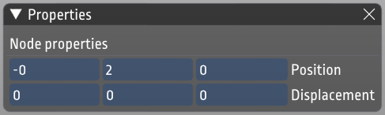
<figcaption>Single node property window</figcaption>
</figure>

Clicking in the position boxes you can directly change the coordinate of the node.

#### Setting a coordinate on many nodes

With several nodes selected, the property inspector shows a **Set position** group. It has one checkbox and one value per axis, and applying it writes only the axes you ticked — the rest keep whatever each node already has.

This is how you flatten or align a group: tick only **Y**, give it `0`, and every selected node drops to ground level while its x and z stay spread as they were. The fields are seeded from the current selection, and show whether the selected nodes already share a value on an axis or are spread over a range.

#### Offsetting and copying

The multiple-selection inspector also carries the move/copy window.

<figure markdown>
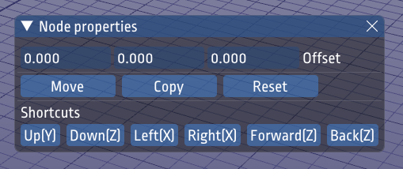
<figcaption>Inspector window with multiple nodes selected.</figcaption>
</figure>

In the **Offset** input boxes an offset can be given, which can be used to move or copy nodes. When nodes have been moved or copied the selection is kept and can be used to repeat the operation. The shortcuts can be used to quickly set an offset for moving in a certain direction.

In the following figure 4 nodes have been selected.

<figure markdown>
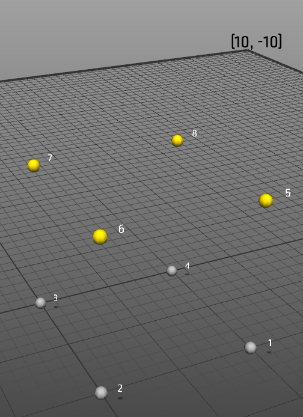
<figcaption>4 nodes selected.</figcaption>
</figure>

Moving these nodes using the property window is shown in the following figure:

<figure markdown>
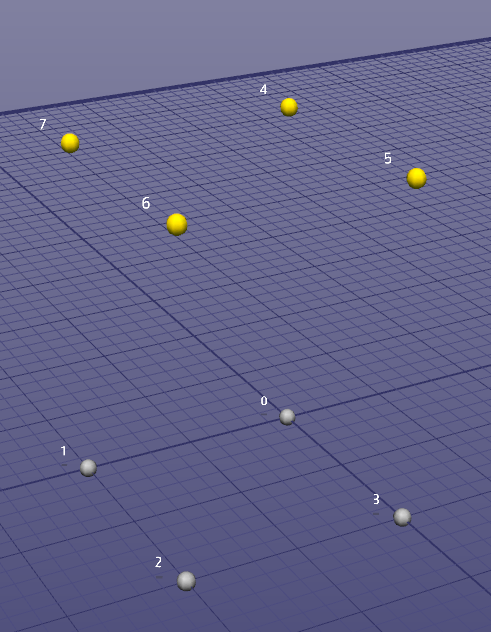
<figcaption>4 nodes moved.</figcaption>
</figure>

Copying the nodes will result in the following result:

<figure markdown>
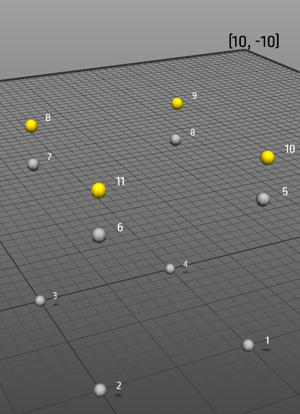
<figcaption>4 nodes copied.</figcaption>
</figure>

!!! note

    The selection will move to the copied nodes, so that you can continue the copy operation multiple times.

### Copying and pasting

**Edit / Copy** ([Ctrl+C]) puts the current selection on the clipboard. What is copied is the selected nodes together with the end nodes of any selected element, and the elements between them — the same rule the geometry commands use, so a copied selection reconstructs as what it looked like.

**Edit / Paste** ([Ctrl+V]) does not drop the copy at a fixed offset. It attaches it to the cursor as a ghost that follows the mouse across the current work plane:

* **Click** to place the copy.
* **Click again** to place another one — the ghost stays on the cursor, so a repeated part can be stamped out several times.
* **[Esc]** cancels without placing anything.

Picking any other tool also ends the paste, so a half-placed copy cannot be left behind a dialog waiting to appear on the next click in the view.

### Repeating a selection with arrays

The offset copy described above copies nodes. An **array** repeats the whole selection - nodes, the beams between them, their materials and cross section rotation - as many times as you ask for, and keeps the original. It is the quickest way to turn one bay into a truss, one frame into a building, or one rib into a rotationally symmetric roof.

Arrays act on the current selection, so select something first. The affected set is the selected nodes together with the end nodes of any selected beam, and every beam with both ends in that set comes along - so selecting beams behaves the way it looks.

There are three kinds:

| Kind | Repeats | Typical use |
| --- | --- | --- |
| Linear | Along one direction | Extend a truss bay by bay |
| Grid | Across a principal plane, two directions at once | A grid of frames |
| Polar | Around an axis | Ribs of a dome, guys of a mast |

#### Quick presets

**Modify/Array** holds ready-made commands that need no dialog:

- **Repeat along X/Y/Z** steps by the length of the selection itself and welds the seams, so the copies join into one continuous structure.
- **Polar about X/Y/Z** places 4, 6, 8 or 12 instances evenly around the world origin.

#### The grid dialog

**Modify/Array/Grid in XY plane...**, **/Grid in XZ plane...** and **/Grid in YZ plane...** open a small dialog that asks only for the two repeats and the two steps, named after the axes of the plane you chose. An XZ grid therefore asks for X repeat, X step, Z repeat and Z step.

#### The transform panel

**Modify/Transform...** opens the transform panel, whose **Array** tab offers all three kinds with their full set of options, including the polar sweep angle and the choice of whether copies rotate. Unlike the dialog it stays open, so you can adjust the numbers and run the command again.

#### Repeats include the original

This is the one thing that is easy to get wrong. A count of 2 gives you the original plus **one** copy, and a 4 x 3 grid is 12 instances, that is 11 copies. The grid controls show the resulting instance and copy counts from the numbers currently in the fields.

The step is likewise the distance **per copy**, not the total span. Tick the **step in selection lengths** option to give steps in bounding box lengths of the selection instead of model units: a step of 1.0 then puts each copy exactly one selection length further on, which is what joins bays end to end.

!!! note

    A flat selection has no length across its own plane. If you array a planar frame out of its plane with **Steps in selection lengths** ticked, that step comes out zero and the command refuses rather than piling every copy onto the original. Give the out-of-plane step in model units instead. This is why the grid controls leave the option off by default.

#### Welding

The **weld tolerance** fuses coincident nodes once the copies are in place, which is what joins the seam between two bays into a shared node instead of leaving two nodes on top of each other. Set it to 0 to leave the copies detached. A weld also moves supports and loads from a node that disappears onto the node that remains.

#### Loads and boundary conditions

A linear or grid array is a pure translation, so a load vector and a support mean exactly the same thing on the copy as on the original. Both are carried across by default, and the copies join the *same* load or boundary condition object, so nothing new appears in the load and boundary condition lists.

A polar array that rotates its copies is different. Distributed beam loads are given in the member's own directions and follow the copy wherever it ends up, so they always come along. A nodal load points somewhere in global coordinates and a partial support restrains a global direction, so neither survives being rotated: they are left off, and the console reports how many were skipped.

!!! note

    A whole array is a single undo step, welding included. The original and every copy are left selected afterwards, so a second array in another direction turns a row into a grid.

### Transforming geometry

**Modify / Transform...** opens a panel that moves the nodes of the current selection rather than adding to them. It has a tab per operation:

| Tab | Does |
| --- | --- |
| **Move** | Translate by a vector |
| **Scale** | Scale, uniformly or per axis |
| **Rotate** | Rotate about a principal axis by an angle |
| **Taper** | Scale perpendicular to an axis by a factor running from one end of the selection to the other |
| **Smooth** | Relax the selection towards its neighbours |
| **Mirror** | Reflect in a principal plane and keep both halves |
| **Array** | Repeat the selection, as described above |

As with arrays, the affected set is the selected nodes together with the end nodes of any selected element. Node and element numbering survives every one of these commands, so scripts and result arrays that refer to a node by index still refer to the same node afterwards.

#### Live preview

Move, Scale, Rotate, Taper and Smooth preview as you type. Every change re-applies the transform from the geometry you started with rather than on top of the previous preview, so the result depends only on the numbers now in the fields, never on the order you dragged the sliders. **Apply** commits it as a single undo step and **Reset** puts the original geometry back.

Mirror and Array add geometry rather than moving it, so they have no preview — they run from their own button.

#### Origin

Every transform is measured from an origin, chosen in the **About** combo: the world origin, the centroid of the affected nodes, the centre of their bounding box, the last picked cursor position, or the low or high face of the bounding box. Scaling about the low face grows a frame upwards from its base; scaling about the centroid grows it about its middle.

Mirror is the exception that needs a plane outside the selection — use the world origin or the low or high face. A mirror plane through the middle of a selection reflects it onto itself, and the weld then removes the copy again. A polar array wants the world origin or the cursor for the same reason: an axis through the selection's own centre spins the copies on top of it.

#### Holding supports and loads in place

Smoothing has two checkboxes, **Hold fixed nodes** and **Hold loaded nodes**, and they are on by default: moving a support or a load point silently changes what the model means. The plain transforms leave them off, because an explicit "rotate this by 15 degrees" should do exactly that.

#### Smoothing

Smoothing is Taubin smoothing, which alternates a shrinking pass (**Lambda**) with an inflating pass (**Mu**, negative). Leaving Mu at 0 gives plain Laplacian smoothing, which pulls a free-standing frame towards its own centre and shortens the span rather than tidying it. **Weight by 1/length** makes short members pull harder than long ones.

Smoothing looks at the neighbours just outside the selection too, so a node at the edge of what you selected is pulled towards the structure it is actually attached to rather than only towards the part you happened to select.

#### Menu presets

**Modify** also holds ready-made versions of the same commands for when the panel is more than the job needs: **Scale** (grow or shrink 10%, stretch 10% along one axis), **Rotate** (90 or 15 degrees about an axis), **Mirror** (about the world origin or either bounding box face), **Taper** (1.0 to 0.5 along an axis) and **Smooth** (light, medium, heavy, or a Laplacian pass).

### Creating elements

Elements are created by using the element tool:

<figure markdown>
{width=100}
<figcaption>Element tool</figcaption>
</figure>

Elements are created by selecting 2 nodes. There is no need to click on the tool multiple times when creating multiple elements. The following figure shows how this is accomplished:

<figure markdown>
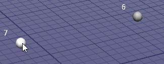
<figcaption>Creating an element step 1</figcaption>
</figure>

<figure markdown>
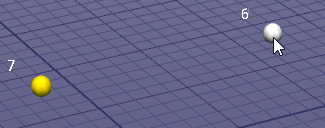
<figcaption>Creating an element step 2</figcaption>
</figure>

<figure markdown>
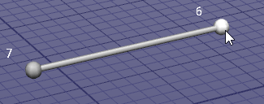
<figcaption>Creating an element stop 3</figcaption>
</figure>

There are two element tools. **Create beam** makes a beam element, which transfers moment through the joint; **Create bar** makes a bar element, which carries axial force only. The Simple interface offers a single element type, so the choice does not have to be made before it is understood.

### Subdividing a structure

To add more elements to an existing structure ObjectiveFrame can subdivide selected elements into smaller elements. This can be useful to better resolve deflections of a structure. The following example illustrates how this works.

We have the following structure:

<figure markdown>
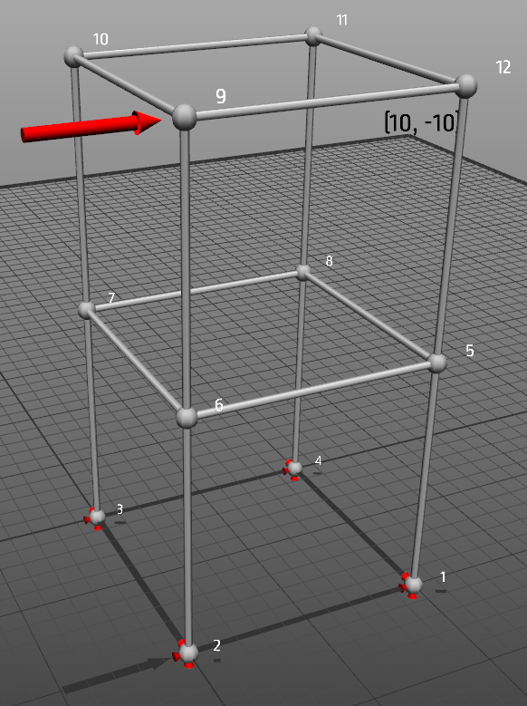
<figcaption>Creating an element stop 3</figcaption>
</figure>

We select everything by pressing [Ctrl+A]. Only the elements matter here, so you can also set the selection filter to elements first. We get the following:

<figure markdown>
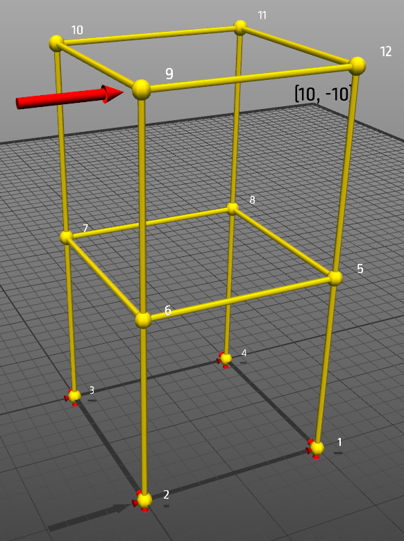
<figcaption>Selecting all elements</figcaption>
</figure>

Now we select **Edit/Subdivde element** from the menu or press [Ctrl+D]. Now the structure becomes:

<figure markdown>
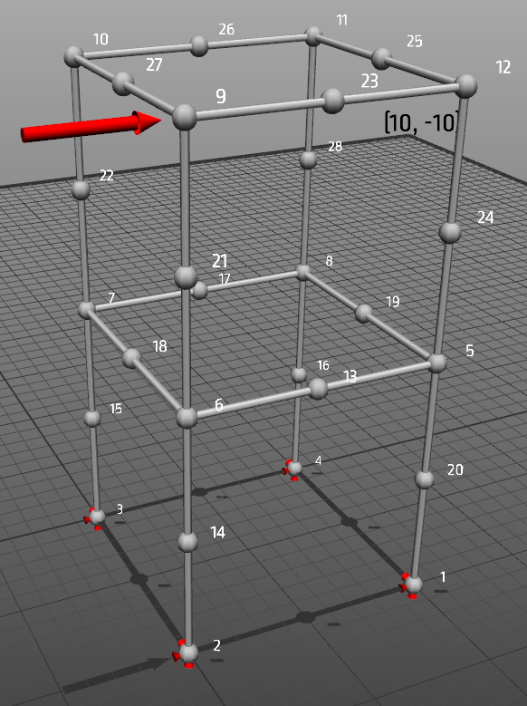
<figcaption>Subdivided structure 1st iteration.</figcaption>
</figure>

Repeating the same procedure one more time we can get the following structure:

<figure markdown>
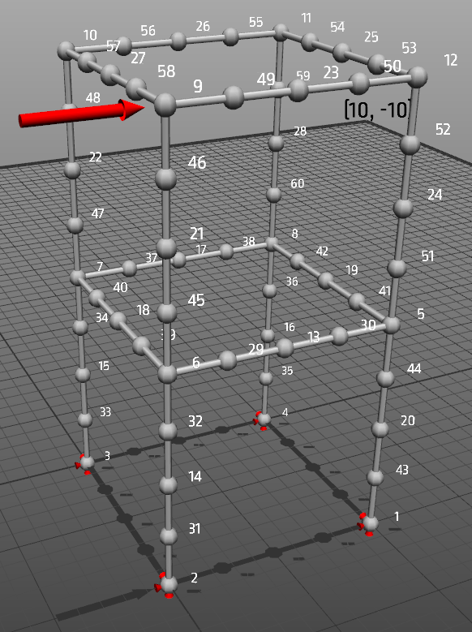
<figcaption>Subdivided structure 2nd iteration.</figcaption>
</figure>

### Creating structures from points

In many cases it can be tedious to create elements between nodes. To aid in this process ObjectiveFrame can automatically generate elements between points using the TetGen mesh generator. To illustrate this process we will create a simple bridge from points, which we will connect using this method.

First we will create a grid of nodes using the **Create/Grids/Node grid** menu. This brings up the following window:

<figure markdown>
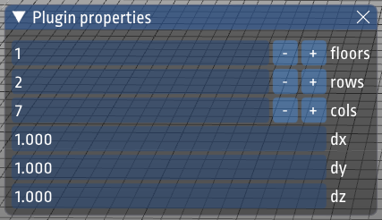
<figcaption>Grid plugin window.</figcaption>
</figure>

Set the values as in shown in the figure. Place the cursor at (0,0,0) and click once with the mouse. This should create the following nodes:

<figure markdown>
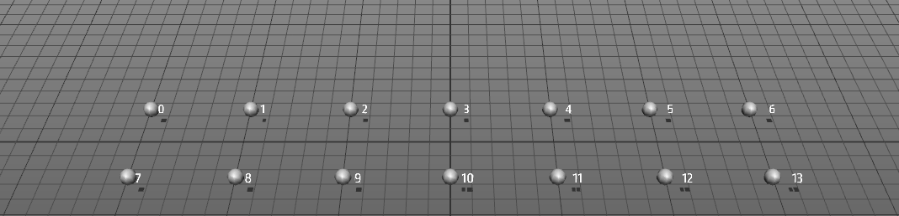
<figcaption>First grid points</figcaption>
</figure>

Next we will create nodes approximately in the middle of each square grid as shown below:

<figure markdown>
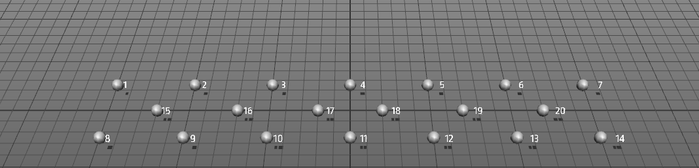
<figcaption>Middle points</figcaption>
</figure>

We will move these points up 0.6 units using the property inspector as shown before or using the move tool.

<figure markdown>
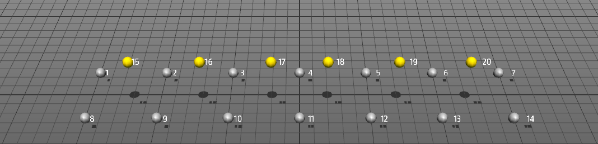
<figcaption>Moved points</figcaption>
</figure>

Next we select the nodes. Set the selection filter to nodes and press [Ctrl+A].

<figure markdown>
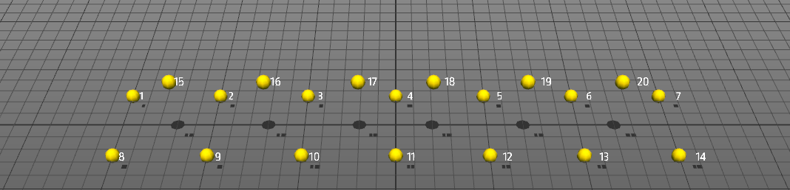
<figcaption>All nodes selected</figcaption>
</figure>

We can now ask ObjectiveFrame to create elements between these nodes automatically by selecting **Edit/Mesh selected** or pressing [Ctrl+M].

<figure markdown>
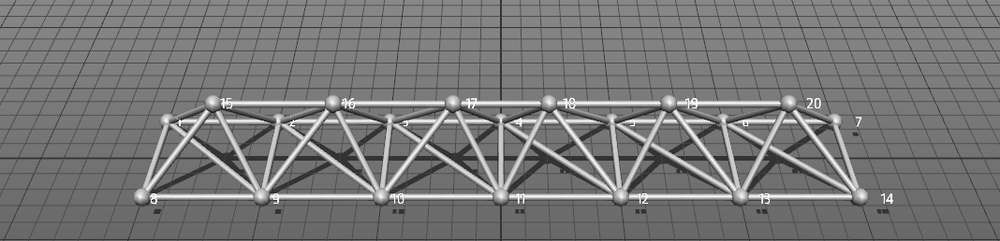
<figcaption>Final mesh</figcaption>
</figure>

A nice truss-like structure has now been created. ObjectiveFrame uses TetGen to generate a tetrahedral mesh from which it extracts the edges to create our structure.

**Edit/Surface selected no ground** and **Edit/Surface selected with ground** do the same for a surface-like set of points, the second including the ground plane in what is meshed.

### Structure generators

The **Create** menu lists the scripted structure generators that ship with ObjectiveFrame, grouped by category: arches, bridges, frames, grids, roofs and domes, structures, towers and trusses. Each one asks for its own parameters — spans, bay counts, radii, numbers of segments — and builds the structure at the cursor.

These are ordinary ChaiScript plugins read from the plugin folder, so you can copy one and edit it. See [ChaiScript scripting](chaiscript.md) for the parameter syntax and the available functions.

## Loads and boundary conditions

### Quick supports and quick forces

The quick tools put a support or a load onto nodes without opening a dialog first. They are the fastest way to get a model standing up and loaded, and they are what the Simple interface leaves in place of the property dialogs.

Both live on the lower toolbar and work the same way:

1. Pick **Quick support** or **Quick force**. Its panel opens with the tool, and closes again when you leave it.
2. Say what to apply — one of five standard supports, or one direction and one magnitude.
3. Either **drag over nodes** to stamp it on as the cursor passes, or select nodes first and press **Apply to selection**.

Holding [Ctrl] while dragging removes instead of applying, and **Remove from selection** does the same for a selection.

The five standard supports are:

| Support | Holds |
| --- | --- |
| **Fixed (all dofs)** | All three translations and all three rotations |
| **Pinned (free to rotate)** | All three translations, free to rotate |
| **Roller X** | Free to move along X, held in Y and Z, free to rotate |
| **Roller Y** | Free to move along Y, held in X and Z, free to rotate |
| **Roller Z** | Free to move along Z, held in X and Y, free to rotate |

Pinned is the default, because it is the support a frame usually wants and it is the weaker of the two obvious choices: a model that should have been built in shows up as a structure that is too soft, while full fixity where a pin was meant quietly stiffens the frame and reads as correct.

A node carries one support at a time, so applying a support replaces whatever the node had — the buttons behave like the radio buttons they look like. The five supports are shared objects rather than one per node, so supporting a hundred nodes still leaves one entry in the boundary condition list.

Quick forces coalesce in the same spirit: a force joins the existing load with the same direction and magnitude, and only makes a new one when nothing matches. A hundred clicks of the same downward force therefore leave one load with a hundred nodes, one entry in the load list and one slider in the load mixer, while a force of a different size still gets its own entry. The panel names the load the next click will feed, so the two can be followed between.

A whole stroke is a single undo step, and a stroke that changes nothing leaves no undo entry.

### Self-weight

**View / Self-weight...**, or the self-weight toggle on the lower toolbar, applies the structure's own weight as a distributed load on every element. It is a property of the model rather than a tool, so it stays on whatever else you are doing, and it is saved with the model.

There are three ways to say how heavy the structure is:

| Mode | Weight comes from |
| --- | --- |
| **Material density** | Each material's density times its cross-section area. Set the density in the material properties. |
| **Mass per length** | One mass per unit length on every element, regardless of material or section |
| **Total load** | One total load, spread over the structure by element length |

The first two turn a mass into a force through **Gravity**, which defaults to 9.81 m/s². **Load factor** scales the result, so a factor of 1.5 gives a factored self-weight case without touching the material data.

Self-weight acts downwards in global coordinates and is projected onto each element's own axes, so it is correct for inclined and vertical members, bars as well as beams. It is added when the model is solved and does not appear as an entry in the load lists. It keeps acting in feedback mode, so a force moved by hand is felt on top of the structure's own weight rather than in place of it. In density mode a material with no density set contributes nothing, which is worth checking if a model that should sag does not.

### Creating boundary conditions / forces

The quick tools cover the common cases. When you need a support that holds an unusual combination of degrees of freedom, a prescribed displacement, or a named load you can assign and reuse, use the property dialogs instead.

Creating boundary conditions and loads is a two-step process. First, a general definition of the load or boundary condition is created, then nodes are assigned with a specific condition. A node assigned with a load or boundary condition will have an icon visualizing the condition assigned to it.

A boundary condition is created by displaying the boundary condition window by clicking on:

<figure markdown>
{width=100}
<figcaption>Boundary condition tool.</figcaption>
</figure>

This brings up the boundary condition window:

<figure markdown>
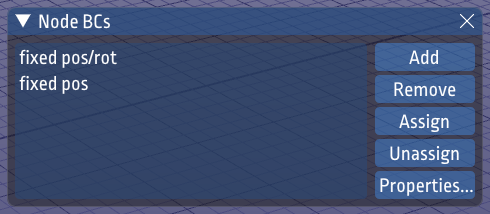
<figcaption>Boundary condition window.</figcaption>
</figure>

ObjectiveFrame automatically creates default boundary conditions for common cases. New conditions can be created by clicking the **Add** button. To edit an existing condition press the **Properties** button this brings up the boundary condition editing dialog:

<figure markdown>
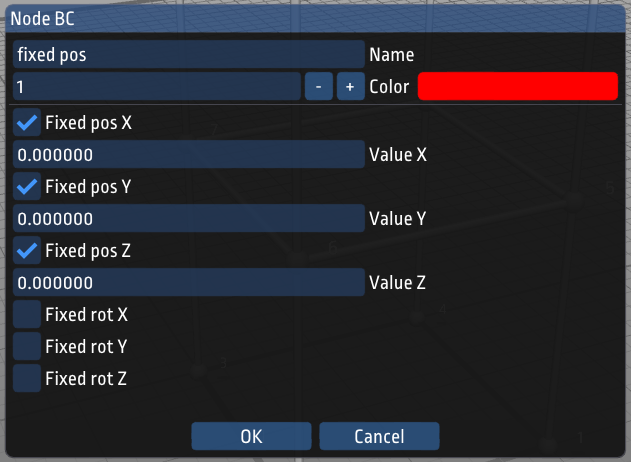
<figcaption>Boundary condition property dialog.</figcaption>
</figure>

In this dialog, the specifics of the boundary condition can be edited. A descriptive name and color can also be given to the condition.

To apply a boundary condition to nodes/element, select the boundary condition in the list and click on the **Assign**-button. The assigned nodes will now have icons attached to them illustrating that they have a load or boundary condition assigned to them (See the following figures).

<figure markdown>

<figcaption>Assigning boundary conditions - step 1.</figcaption>
</figure>

<figure markdown>
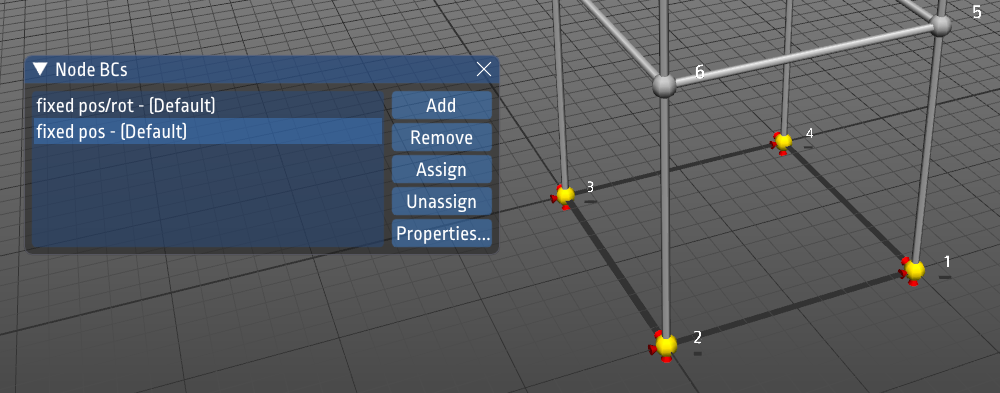
<figcaption>Assigning boundary conditions - step 2.</figcaption>
</figure>

Loads are created using the same procedure as boundary conditions.

!!! note

    These four dialogs — node loads, beam loads, node boundary conditions and materials — are not shown in the Simple interface. A model that uses them keeps all of its data; the dialogs come back when you switch to Advanced.

### Quickly adding boundary conditions to a structure

It is possible to quickly add boundary conditions to a structure by using the menu function **Edit/Fix ground nodes** or **Edit/Fix position ground nodes** this will apply these boundary conditions to the nodes that are located with a y-coordinate of 0.0.

There are also menu functions for assigning default boundary conditions to a selected set of nodes using **Edit/Fix selected nodes** and **Edit/Fix position selected nodes**.

<figure markdown>
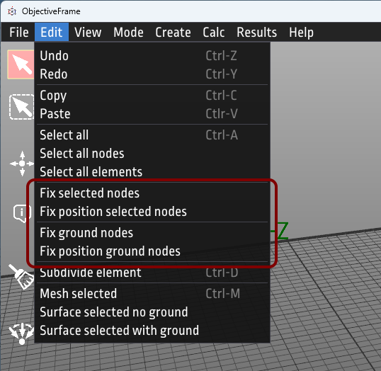
<figcaption>Menu function for creating boundary conditions.</figcaption>
</figure>

## Materials and section properties

### Defining material and section properties

Section and material properties are defined in the material properties window. This window is shown by pressing the right-most button in the lower toolbar.

<figure markdown>
{width=100}
<figcaption>Material property tool</figcaption>
</figure>

This brings up the materials window.

<figure markdown>
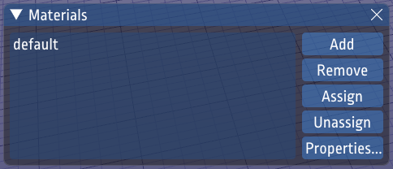
<figcaption>Materials window.</figcaption>
</figure>

All new elements will be assigned the **default** section property. To assign elements different section properties, create a new section property and assign it using the **Assign** button. Modifying a section property can be done by clicking on the **Properties...** button. This will bring up the section property dialog.

<figure markdown>
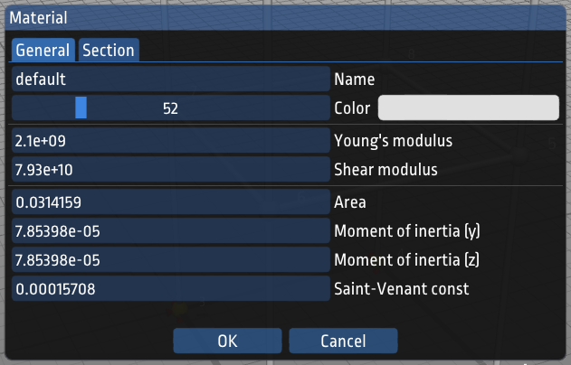
<figcaption>Material property window.</figcaption>
</figure>

In the first tab name, color and property values can be assigned. In the second tab **Section** values for several standardized sections can be computed.

The material also carries a **density**, which is what self-weight uses in its density mode.

### Rotation of element

The element orientation can be changed by using the property inspector when a beam(s) are selected.

## Computing structure response and element forces

### Computing element forces

ObjectiveFrame can compute deflections and element forces by selecting **Calc/Execute** in the menu or pressing [Ctrl+R]. A check will be made to see if boundary conditions and forces have been applied to the model. By default the deflections are computed and visualised.

<figure markdown>

<figcaption>Default results.</figcaption>
</figure>

Other visualisation modes can be selected from the result toolbar under the coordinate display, or from the **Results** menu. The following figures show normal forces and moments visualised.

<figure markdown>

<figcaption>Normal forces.</figcaption>
</figure>

<figure markdown>

<figcaption>Moments</figcaption>
</figure>

The available result types are normal force, torsion, shear, moment, Navier utilization, and no result.

If the calculation cannot be solved because the structure is unstable or under-constrained, ObjectiveFrame computes eigenmodes instead and shows how the structure moves. See [Eigenmode solver](eigenmode-solver.md).

### Reading the results

Several commands change how results are drawn rather than what is computed:

| Command | Shortcut | Does |
| --- | --- | --- |
| **Results / X-ray mode** | [Alt+X] | Draw the structure translucently so interior members and results are visible |
| **Results / Scaling settings...** | | Set or lock the displacement scale factor, and animate the deformation |
| **Results / Color scale settings...** | | Edit the colours used for each result type |
| **View / Show loads** | [Alt+1] | Show or hide load arrows |
| **View / Show reaction forces** | [Alt+2] | Show or hide reaction arrows at the supports |
| **View / Show node numbers** | [Alt+3] | Label nodes with their index |
| **View / Show shadows** | [Alt+4] | Cast a shadow onto the ground plane, which helps read depth |

The displacement scale factor is chosen automatically from the size of the model and the size of the deformation. **Lock scale factor** keeps it fixed, which is what you want when comparing two load cases or two models — otherwise each solve rescales and two different responses can look the same.

The colour scale dialog has separate colours for tension and compression in axial force, one ramp shared by torsion, shear and moment, and one for Navier utilization. Changes apply immediately.

Shadows are drawn against the opaque background, so they are unavailable in X-ray mode; the menu item shows as disabled rather than quietly doing nothing.

### Evaluating the structure using the feedback mode

ObjectiveFrame has a special mode to evaluate how a force affects a structure in real-time. This mode is activated by selecting the feedback-button in the upper left toolbar.

<figure markdown>
{width=100}
<figcaption>Feedback mode</figcaption>
</figure>

When selected a special feedback force can be placed on a node and moved by using the mouse. The structure will re-compute and results are updated in real-time. The following figures shows how the load is applied and updated:

<figure markdown>
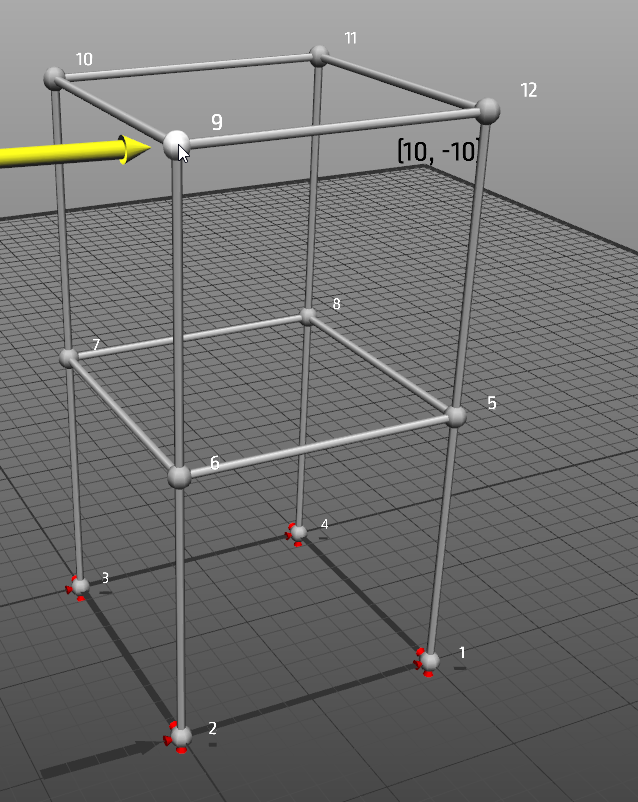
<figcaption>Selecting node</figcaption>
</figure>

<figure markdown>
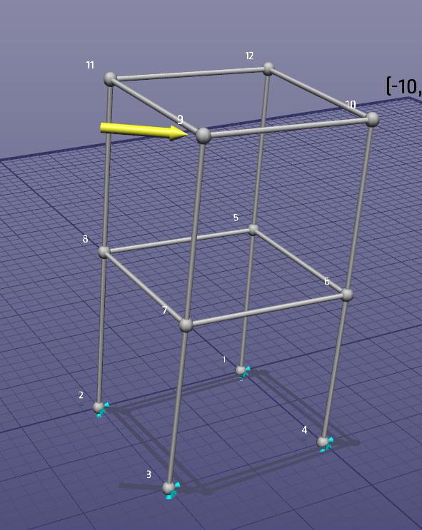
<figcaption>Moving feedback force with mouse.</figcaption>
</figure>

Interact with a different node by clicking on it. Section forces can be visualised by using the **Results**-menu or the result toolbar.

<figure markdown>

<figcaption>Feedback mode with results.</figcaption>
</figure>

The **Load mixer** opens alongside feedback mode. It gives one slider per load in the model, so the existing load cases can be scaled up and down and the structure watched while the feedback force is moved.

## Representation modes

The **Mode** menu says what the view is drawing:

| Mode | Shows |
| --- | --- |
| **Model** | The FEM model — elements as tubes, with loads and supports |
| **Geometry** | The same structure drawn with its real cross sections |
| **Results** | The deformed structure with the selected result on it |
| **Feedback** | Feedback mode, described above |

Running an analysis switches the view onto the deformed structure by itself, so **Mode** is mostly there for going back. A geometry command switches out of a deformed view for the opposite reason: a deformation drawn on top of geometry that has just moved would mix a new structure with an old response.

## Preferences

**File / Preferences...** holds the application-wide settings:

- **Workspace**: workspace size, node size, line radius, load arrow size, and how many sides a beam is drawn with.
- **Display**: sphere nodes, node numbers, the construction plane indicator, shadows, and the opacity of the ground surface. A partly transparent ground lets reaction arrows below the plane show through, and fades the shadow with it.
- **Interface**: UI scale for high-DPI displays, whether to use the built-in file dialogs, and whether to save a screenshot next to the model when saving.
- **Automation API**: start or stop the local HTTP service. See [Automation API](rest-api.md).
- **AI API key**: the key used by the [AI integration](llm-integration.md), which can be pasted from the clipboard.

## Keyboard shortcuts

| Shortcut | Does |
| --- | --- |
| [Ctrl+N] | New model |
| [Ctrl+O] | Open model |
| [Ctrl+S] | Save model |
| [Ctrl+Z] / [Ctrl+Y] | Undo / redo |
| [Ctrl+C] / [Ctrl+V] | Copy / paste |
| [Ctrl+A] | Select all, honouring the selection filter |
| [Ctrl++] / [Ctrl+-] | Grow / shrink the selection |
| [Ctrl+D] | Subdivide the selected elements |
| [Ctrl+M] | Mesh the selected nodes |
| [Ctrl+R] | Run the analysis |
| [Alt+S] | Select tool |
| [Alt+P] | Paint select tool |
| [Alt+M] | Move tool |
| [Alt+N] | Create node tool |
| [Alt+L] | Create element tool |
| [Alt+X] | X-ray mode |
| [Alt+1] … [Alt+4] | Loads, reaction forces, node numbers, shadows |
| [Esc] | Cancel a drag, a paste, or a work plane point pick |

Shortcuts are ignored while a panel has keyboard focus, so typing a number into a field never triggers a command.

!!! note

    [Ctrl++] and [Ctrl+-] are matched by what the key prints on your keyboard layout rather than by where it sits, so they work on non-US layouts where `+` and `-` are in different places.

## Other functions

### Exporting to CALFEM for Python

Currently it is possible to export nodes and elements to CALFEM for Python by using the **File/Save as CALFEM...** menu. Only node coordinates and topology is exported currently. This method will be updated in upcoming versions. **File/Open from CALFEM...** reads such a model back.

### Scripting and automation

**File/New script...**, **File/Open script...** and **File/Run script...** work with ChaiScript files, and **View/Script editor...** opens the editor. See [ChaiScript scripting](chaiscript.md).

ObjectiveFrame can also be driven from another program over a local HTTP service, which is how the Python client works. See [Automation API](rest-api.md).

### Secondary view

**View/Secondary view...** opens a second view of the same model. Eigenmode animation can be sent to it, so the model stays editable in the main window while the mode shape animates beside it.
