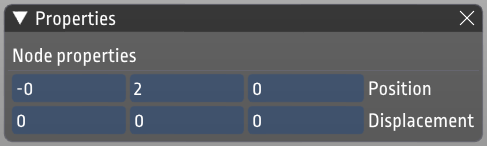
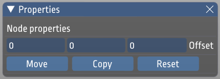
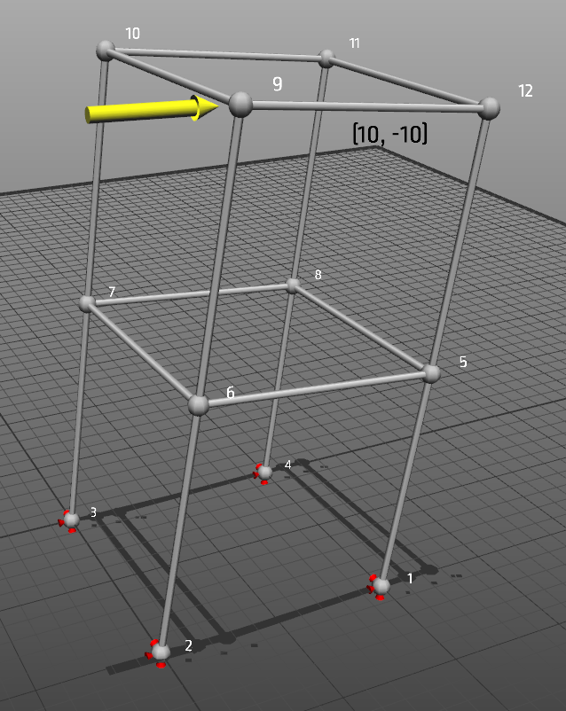

---
hide:
  - navigation
---

# Using ObjectiveFrame

To give a short overview of what ObjectiveFrame can offer please view the following tutorial:

<iframe width="560" height="315" src="https://www.youtube.com/embed/ejHFFXANx7o" title="YouTube video player" frameborder="0" allow="accelerometer; autoplay; clipboard-write; encrypted-media; gyroscope; picture-in-picture" allowfullscreen></iframe>

## Main window and view

When you start the application the main workspace is displayed. The workspace is your workbench where you create your structures. By default the workspace is 20 x 20 units large. The size can be changed from the **View/Settings...** dialog. 

The view can be changed using the mouse. All view functions are handled by the right mouse button in combination with a modifier key. 

* Holding down the right button and moving the mouse will rotate the view.
* Holding down the right button with the [Shift]-key will pan the view.
* Holding down the right button with the [Alt]-key will zoom in and out.

On the screen is also a **Hints** windows displaying helpful hints for the different available tools.

The top left toolbar contains the editing toolbar providing selection, move, copy, remove and property inspection functionality.

The lower let toolbar contains functions for creating nodes, elements, loads, boundary conditions and section properties. These are described in the following sections.

## Creating nodes

Nodes are created by selecting the node tool (first icon to the left in the lower toolbar). A cursor is shown on the workspace:

{: style="width:50%"}

At the top right of the window the current position of the cursor is shown:

By default the cursor is locked in the XZ-plane, but can be moved vertically in the Y-direction by holding down the [Shift]-modifier.

{: style="width:50%"}

## Selecting elements/nodes

Selecting nodes and elements is done using the select tool (Top tool in the top left toolbar). 

{: style="width:5%"}

Nodes that are selected are highlighted when the mouse is moved over them. Clicking on a node will add it to the selection. The current selection is highlighted in yellow.

{: style="width:50%"}

Clearing the current selection is done by clicking anywhere in the workspace.

## Moving nodes

As ObjectiveFrame uses node based geometry the only objects that can be moved are nodes. Moving a node can be done in several ways. A single node can be moved by selecting it using the select tool and then clicking the inspect-tool.

{: style="width:5%"}

When a single node is selected the following dialog is shown:

{: style="width:50%"}

Clicking in the position boxes you can directly change the coordinate of the nodes.

When multiple nodes are selected brings up the move/copy window instead.

{: style="width:50%"}

In the **Offset** input boxes an offset can be given, which can be used to move or copy nodes. When nodes have been moved or copy the selection is kept and can be used to repeat the operation. The shortcuts can be used to quickly set an offset for moving in a certain direction.

In the following figure 4 nodes have been selected. 

{: style="width:50%"}

Moving these nodes using the property window is shown in the following figure:

{: style="width:50%"}

Copying the nodes will result in the following result:

{: style="width:50%"}

!!! note

    The selection will move to the copied nodes, so that you can continue the copy operation multiple times.

## Creating elements

Elements are created by using the element tool:

{: style="width:5%"}

Elements are created by selecting 2 nodes. There is no need to click on the tool multiple times when creating multiple elements. The following figure shows how this is accomplished:

{: style="width:50%"}

{: style="width:50%"}

{: style="width:50%"}

## Creating boundary conditions / forces

Creating boundary conditions and loads is a two-step process. First, a general definition of the load or boundary condition is created, then nodes are assigned with a specific condition. A node assigned with a load or boundary condition will have an icon visualizing the condition assigned to it. 

A boundary condition is created by displaying the boundary condition window by clicking on:

{: style="width:5%"}

This brings up the boundary condition window:

{: style="width:50%"}

ObjectiveFrame automatically creates default boundary conditions for common cases. New conditions can be created by clicking the **Add** button. To edit an existing condition press the **Properties** button this brings up the boundary condition editing dialog:

{: style="width:50%"}

In this dialog, the specifics of the boundary condition can be edited. A descriptive name and color can also be given to the condition. 

To apply a boundary condition to nodes/element, select the boundary condition in the list and click on the **Assign**-button. The assigned nodes will now have icons attached to them illustrating that they have a load or boundary condition assigned to them (See the following figures).

{: style="width:50%"}

{: style="width:50%"}

Loads are created using the same procedure as boundary conditions.

## Defining section properties

Section properties are defined in the section properties window. This window is shown by pressing the right-most button in the lower toolbar.

{: style="width:5%"}

This brings up the section properties window.

{: style="width:50%"}

All new elements will be assigned the **default** section property. To assign elements different section properties, create a new section property and assign it using the **Assign** button. Modifying a section property can be done by clicking on the **Properties...** button. This will bring up the section property dialog.

{: style="width:50%"}

In the first tab name, color and property values can be assigned. In the second tab **Section** values for several standardized sections can be computed. 

## Rotation of element

The element orientation can be changed by using the property inspector when a beam(s) are selected.

## Computing element forces

ObjectiveFrame can compute deflections and element forces by selecting **Calculation/Execute** in the menu. A check will be made to see if boundary conditions and forces have been applied to the model. By default the deflections are computed and visualised. 

{: style="width:50%"}

Other visualisation modes can be selected using the **Result**-menu. The following figures shows normal forces and moments visualised.

{: style="width:50%"}

{: style="width:50%"}

!!! note

    Only node deflections are visualised currently. This could change in upcoming versions.

## Evaluating the structure using the feedback mode

ObjectiveFrame has a special mode to evaluate how a force affects a structure in real-time. This mode is activated by selecting the feedback-button in the upper left toolbar.

{: style="width:5%"}

When selected a special feedback force can be placed on a now and moved by using the mouse. The structure will re-compute and results are updated in real-time. The following figures shows how the load is applied and updated:

{: style="width:50%"}

{: style="width:50%"}

Interact with a different node by clicking on it. Section forces can be visualised by using the **Result**-menu.

{: style="width:50%"}

## Exporting to CALFEM for Python

Currently it is possible to export nodes and elements to CALFEM for Python by using the **File/Save as CALFEM...** menu. Only node coordinates and topology is exported currently. This method will be updated in upcoming versions.

