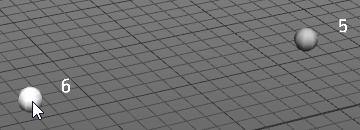
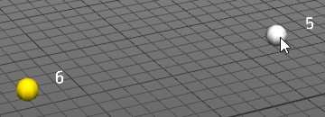
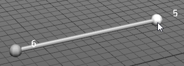
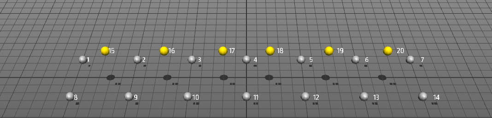
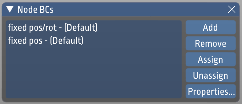
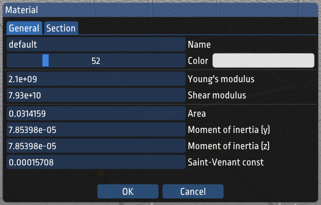

---
hide:
  - navigation
---

# Using ObjectiveFrame

To give a short overview of what ObjectiveFrame can offer please view the following tutorial:

<iframe width="560" height="315" src="https://www.youtube.com/embed/ejHFFXANx7o" title="YouTube video player" frameborder="0" allow="accelerometer; autoplay; clipboard-write; encrypted-media; gyroscope; picture-in-picture" allowfullscreen></iframe>

## Main window and view

When you start the application the main workspace is displayed. The workspace is your workbench where you create your structures. By default the workspace is 20 x 20 units large. The size can be changed from the **View/Settings...** dialog. 

The view can be changed using the mouse. All view functions are handled by the right mouse button in combination with a modifier key. 

* Holding down the right button and moving the mouse will rotate the view.
* Holding down the right button with the [Shift]-key will pan the view.
* Holding down the right button with the [Alt]-key will zoom in and out.

On the screen is also a **Hints** windows displaying helpful hints for the different available tools.

The top left toolbar contains the editing toolbar providing selection, move, copy, remove and property inspection functionality.

The lower let toolbar contains functions for creating nodes, elements, loads, boundary conditions and section properties. These are described in the following sections.

## Modeling

### Creating nodes

Nodes are created by selecting the node tool (first icon to the left in the lower toolbar). A cursor is shown on the workspace:

<figure markdown>

<figcaption>Workspace cursor</figcaption>
</figure>

At the top right of the window the current position of the cursor is shown:

<figure markdown>

<figcaption>Coordinate display.</figcaption>
</figure>

By default the cursor is locked in the XZ-plane, but can be moved vertically in the Y-direction by holding down the [Shift]-modifier.

<figure markdown>

<figcaption>Locking cursor in Y-direction.</figcaption>
</figure>

### Selecting elements/nodes

Selecting nodes and elements is done using the select tool (Top tool in the top left toolbar). 

<figure markdown>
{width=100}
<figcaption>Select tool</figcaption>
</figure>

Nodes that are selected are highlighted when the mouse is moved over them. Clicking on a node will add it to the selection. The current selection is highlighted in yellow.

<figure markdown>

<figcaption>Selected nodes.</figcaption>
</figure>

Clearing the current selection is done by clicking anywhere in the workspace.

### Moving/Copying nodes

As ObjectiveFrame uses node based geometry the only objects that can be moved are nodes. Moving a node can be done in several ways. A single node can be moved by selecting it using the select tool and then clicking the inspect-tool.

<figure markdown>
{width=100}
<figcaption>Inspector tool</figcaption>
</figure>

When a single node is selected the following dialog is shown:

<figure markdown>

<figcaption>Single node property window</figcaption>
</figure>

Clicking in the position boxes you can directly change the coordinate of the nodes.

When multiple nodes are selected brings up the move/copy window instead.

<figure markdown>

<figcaption>Inspector window with multiple nodes selected.</figcaption>
</figure>

In the **Offset** input boxes an offset can be given, which can be used to move or copy nodes. When nodes have been moved or copy the selection is kept and can be used to repeat the operation. The shortcuts can be used to quickly set an offset for moving in a certain direction.

In the following figure 4 nodes have been selected. 

<figure markdown>

<figcaption>4 nodes selected.</figcaption>
</figure>

Moving these nodes using the property window is shown in the following figure:

<figure markdown>

<figcaption>4 nodes moved.</figcaption>
</figure>

Copying the nodes will result in the following result:

<figure markdown>

<figcaption>4 nodes copied.</figcaption>
</figure>

!!! note

    The selection will move to the copied nodes, so that you can continue the copy operation multiple times.

### Creating elements

Elements are created by using the element tool:

<figure markdown>
{width=100}
<figcaption>Element tool</figcaption>
</figure>

Elements are created by selecting 2 nodes. There is no need to click on the tool multiple times when creating multiple elements. The following figure shows how this is accomplished:

<figure markdown>

<figcaption>Creating an element step 1</figcaption>
</figure>

<figure markdown>

<figcaption>Creating an element step 2</figcaption>
</figure>

<figure markdown>

<figcaption>Creating an element stop 3</figcaption>
</figure>

### Subidiving a structure

To add more element to an existing structure ObjectiveFrame can subdived selected elements into smaller elements. This can be useful to better resolve deflections of a structure. The following example illustrates how this works.

We have the following structure:

<figure markdown>

<figcaption>Creating an element stop 3</figcaption>
</figure>

We select all element by pressing [Ctrl+A]. We get the following:

<figure markdown>

<figcaption>Selecting all elements</figcaption>
</figure>

Now we select **Edit/Subdivde element** from the menu or press [Ctrl+D]. Now the structure becomes:

<figure markdown>

<figcaption>Subdvided structure 1st iteration.</figcaption>
</figure>

Repeating the same procedure one more time we can get the following structure:

<figure markdown>

<figcaption>Subdvided structure 2nd iteration.</figcaption>
</figure>

### Creating structures from points

In many cases it can be tedious to create elements between nodes. To aid in this process ObjectiveFrame can automatically generate elements between points using the TetGen mesh generator. To illustrate this process we will crate a simple bridge from points, which we will connect using this method.

First we will create a grid of nodes using the **Create/Grid** menu. This brings upp the following window:

<figure markdown>

<figcaption>Grid plugin window.</figcaption>
</figure>

Set the values as in shown in the figure. Place the cursor at (0,0,0) and click once with the mouse. This should create the following nodes:

<figure markdown>

<figcaption>First grid points</figcaption>
</figure>

Next we will create nodes approximately in the middle of each square grid as shown below:

<figure markdown>

<figcaption>Middle points</figcaption>
</figure>

We will move these points up 0.6 units using the property inspector as shown before or using the move tool.

<figure markdown>

<figcaption>Moved points</figcaption>
</figure>

Next we select all nodes using [Ctrl+A].

<figure markdown>

<figcaption>All nodes selected</figcaption>
</figure>

We can now ask ObjectiveFrame to create elements between these nodes automatically by selecting **Edit/Mesh selected** or pressing [Ctrl+M].

<figure markdown>

<figcaption>Final mesh</figcaption>
</figure>

A nice truss like structure has now been created. ObjectiveFrame uses TetGen to generate tetrahedral mesh from wich it extracts the edges to create our structure.

## Boundary conditions

### Creating boundary conditions / forces

Creating boundary conditions and loads is a two-step process. First, a general definition of the load or boundary condition is created, then nodes are assigned with a specific condition. A node assigned with a load or boundary condition will have an icon visualizing the condition assigned to it. 

A boundary condition is created by displaying the boundary condition window by clicking on:

<figure markdown>
{width=100}
<figcaption>Boundary condition tool.</figcaption>
</figure>

This brings up the boundary condition window:

<figure markdown>

<figcaption>Boundary condition window.</figcaption>
</figure>

ObjectiveFrame automatically creates default boundary conditions for common cases. New conditions can be created by clicking the **Add** button. To edit an existing condition press the **Properties** button this brings up the boundary condition editing dialog:

<figure markdown>

<figcaption>Boundary condition property dialog.</figcaption>
</figure>

In this dialog, the specifics of the boundary condition can be edited. A descriptive name and color can also be given to the condition. 

To apply a boundary condition to nodes/element, select the boundary condition in the list and click on the **Assign**-button. The assigned nodes will now have icons attached to them illustrating that they have a load or boundary condition assigned to them (See the following figures).

<figure markdown>

<figcaption>Assigning boundary conditions - step 1.</figcaption>
</figure>

<figure markdown>

<figcaption>Assigning boundary conditions - step 2.</figcaption>
</figure>

Loads are created using the same procedure as boundary conditions.

### Quickly adding boundary conditions to a structure

It is possible to quickly add boundary conditions to a structure by using the menu function **Edit/Fix ground nodes** or **Edit/Fix position ground nodes** this will apply these boundary conditions to the nodes that are located with a y-coordinate of 0.0. 

There are also menu functions for assigning default boundary conditions to a selected set of nodes using **Edit/Fix selected nodes** and **Edit/Fix position selected nodes**.

<figure markdown>

<figcaption>Menu function for creating boundary conditions.</figcaption>
</figure>

## Materials and section properties

### Defining material and section properties

Section and material properties are defined in the material properties window. This window is shown by pressing the right-most button in the lower toolbar.

<figure markdown>
{width=100}
<figcaption>Material property tool</figcaption>
</figure>

This brings up the materials window.

<figure markdown>

<figcaption>Materials window.</figcaption>
</figure>

All new elements will be assigned the **default** section property. To assign elements different section properties, create a new section property and assign it using the **Assign** button. Modifying a section property can be done by clicking on the **Properties...** button. This will bring up the section property dialog.

<figure markdown>

<figcaption>Material property window.</figcaption>
</figure>

In the first tab name, color and property values can be assigned. In the second tab **Section** values for several standardized sections can be computed. 

### Rotation of element

The element orientation can be changed by using the property inspector when a beam(s) are selected.

## Computing structure response and element forces

### Computing element forces

ObjectiveFrame can compute deflections and element forces by selecting **Calc/Execute** in the menu or pressing [Ctrl+R]. A check will be made to see if boundary conditions and forces have been applied to the model. By default the deflections are computed and visualised. 

<figure markdown>

<figcaption>Default results.</figcaption>
</figure>

Other visualisation modes can be selected using the **Result**-menu. The following figures shows normal forces and moments visualised.

<figure markdown>

<figcaption>Normal forces.</figcaption>
</figure>

<figure markdown>

<figcaption>Moments</figcaption>
</figure>

!!! note

    Only node deflections are visualised currently. This could change in upcoming versions.

### Evaluating the structure using the feedback mode

ObjectiveFrame has a special mode to evaluate how a force affects a structure in real-time. This mode is activated by selecting the feedback-button in the upper left toolbar.

<figure markdown>
{width=100}
<figcaption>Feedback mode</figcaption>
</figure>

When selected a special feedback force can be placed on a now and moved by using the mouse. The structure will re-compute and results are updated in real-time. The following figures shows how the load is applied and updated:

<figure markdown>

<figcaption>Selecting node</figcaption>
</figure>

<figure markdown>

<figcaption>Moving feedback force with mouse.</figcaption>
</figure>

Interact with a different node by clicking on it. Section forces can be visualised by using the **Result**-menu.

<figure markdown>

<figcaption>Feedback mode with results.</figcaption>
</figure>

## Other functions

### Exporting to CALFEM for Python

Currently it is possible to export nodes and elements to CALFEM for Python by using the **File/Save as CALFEM...** menu. Only node coordinates and topology is exported currently. This method will be updated in upcoming versions.

